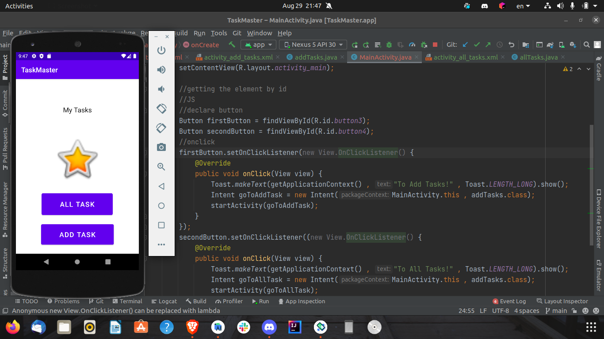
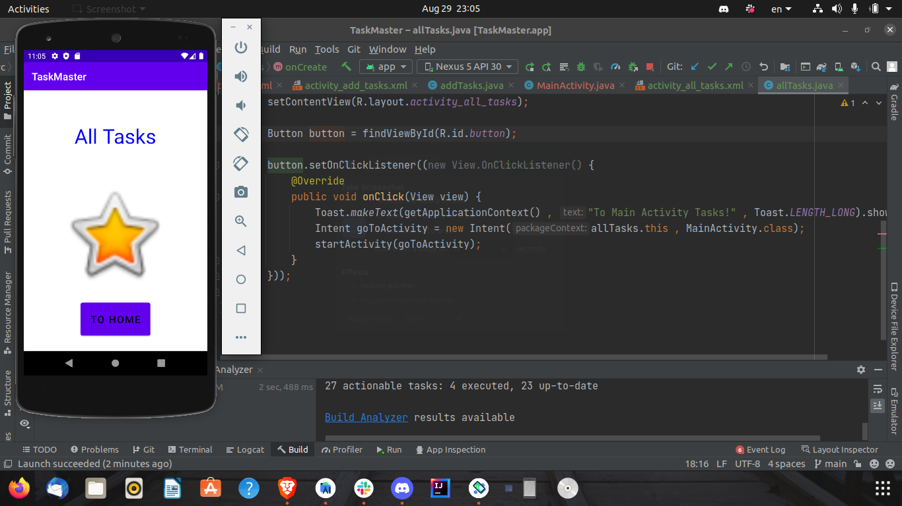

# TaskMaster

## Created Three Page

* Main Activity
* Add Tasks
* All Tasks

### Main Avtivity components:

* Tow butoons each of them go to one of addTask or AllTask page
* Picture in the mid of the phone
* Title

### Add Tasks Components:

* Add Task button `without functionality`
* Tow Input text
* Title

### All Tasks Components:

* Home button Go to the Main Activity Page 
* Picture and Title

