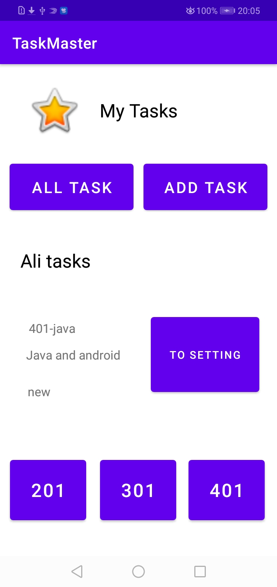
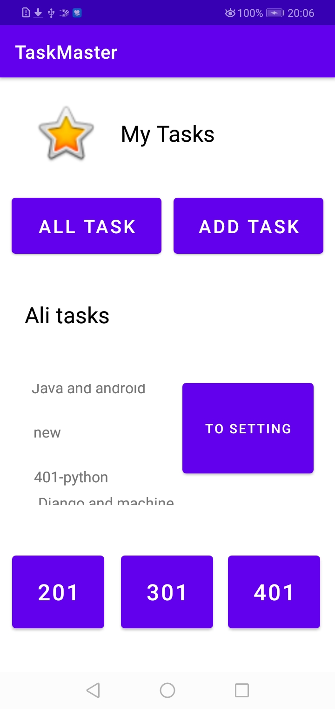
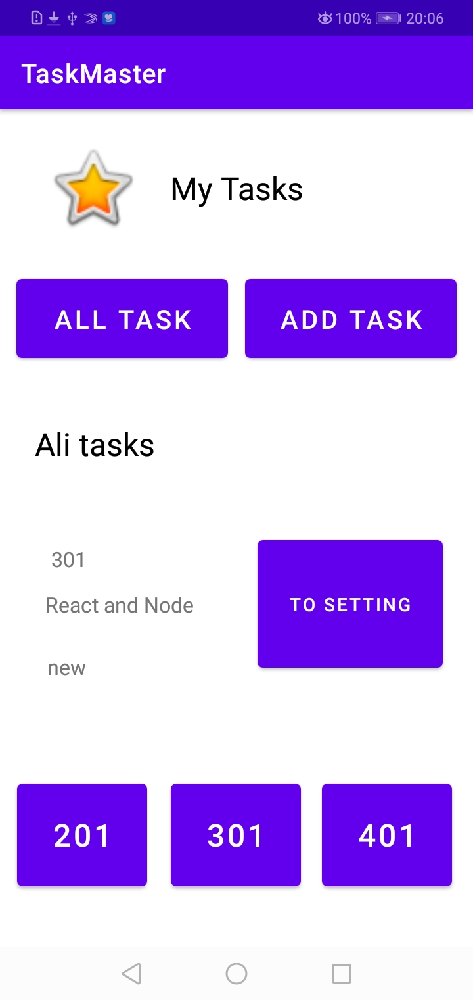

# Describes

>**After returned many source and understand the means of recyclerView -> It's like the faceBook list.**

* Ali(me) Shared a post
* Hanaa Shareb a post 
* Mohammad Shared a post
* Ayyoub shared a post

**All of us to merge all posts need tow or three page and if I used the `recyclerview` i can put all in the one page.**

some screen shots a `recyclerview` in the main page

In the list i added as a title the 401 component like JS and java ... and 301 level.